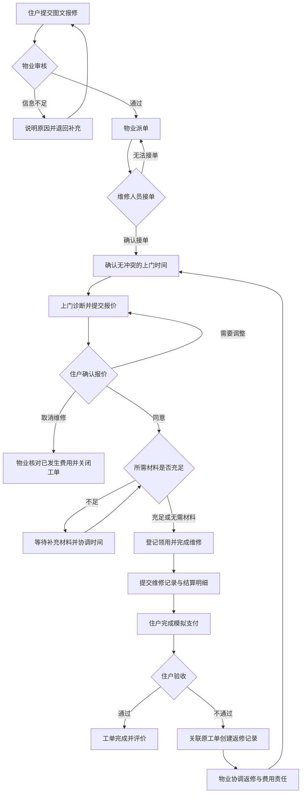

# 社区报修与上门维修服务平台

> 微服务开发与实践课程项目｜霍利屹｜2412190707

本项目面向社区住户、物业管理人员与维修人员，围绕社区报修提供从故障登记到维修验收的完整服务流程，并作为后续数据库持久化、微服务拆分、认证授权、消息通信、事务处理、监控和部署的实践载体。

**当前阶段：Spring Boot 最小可运行工程。** 已加入应用入口、基础 YAML 配置、Spring Web MVC、Actuator、问候和状态 GET 接口及启动测试；下文业务功能仍为后续规划。

## 本周工程与运行说明

- Java：25；Spring Boot：4.0.8；构建工具：Maven（使用仓库内 Maven Wrapper）。
- Spring Initializr Group 与 Package name：`com.zjgsu.hly`。
- 项目名称沿用“社区报修与上门维修服务平台”，应用名为 `community-repair`。
- 默认端口：`8080`。唯一应用配置文件为 `monolith/src/main/resources/application.yml`。
- 本周只实现应用启动、问候接口和健康状态验证，不包含业务实体、完整 REST API、Service、Repository 或数据库，也不需要配置数据库。

### 环境要求

| 项目 | 要求 |
|---|---|
| Java | JDK 25，需包含 `java` 和 `javac`；`JAVA_HOME` 指向 JDK 25 安装目录 |
| Spring Boot | 4.0.8，由 `monolith/pom.xml` 固定版本 |
| Maven | 使用工程自带 Maven Wrapper，当前固定 Maven 3.9.16；无需另行安装全局 Maven |
| 网络 | 首次运行需下载 Wrapper 对应的 Maven 及项目依赖 |
| 端口 | 默认使用 8080，启动前确保未被其他应用占用 |
| 数据库 | 本周不需要安装或配置数据库 |

在 `monolith/` 中执行 `./mvnw -v`（PowerShell 使用 `.\mvnw.cmd -v`），应确认 Maven 3.9.16 和 Java 25。IDEA 的项目 SDK、Maven 运行 JRE，以及命令行的 `JAVA_HOME` 都应使用 JDK 25。

### 目录结构

```text
microservices-practice-2412190707/
├── README.md
├── docs/
└── monolith/                     # 独立 Maven 工程
    ├── pom.xml
    ├── mvnw
    ├── mvnw.cmd
    ├── .mvn/wrapper/maven-wrapper.properties
    └── src/
        ├── main/
        │   ├── java/com/zjgsu/hly/
        │   │   ├── CommunityRepairApplication.java
        │   │   ├── StatusController.java
        │   │   └── HelloController.java
        │   └── resources/application.yml
        └── test/java/com/zjgsu/hly/CommunityRepairApplicationTests.java
```

### 在 IntelliJ IDEA 中运行

1. 选择 **File → Open**，打开 `monolith/pom.xml`，选择作为项目打开，并等待 Maven 同步完成。
2. 在 **Project Structure → Project SDK** 中选择 JDK 25；Maven 的 Importer JDK 和 Runner JRE 也选择 JDK 25 或 Project SDK。
3. Maven home path 选择 **Maven Wrapper**。首次运行需要联网下载 Maven 和依赖。
4. 打开 `CommunityRepairApplication`，点击 `main` 方法旁的运行按钮。日志显示 Tomcat 在 8080 端口启动后访问状态接口。
5. 打开 `CommunityRepairApplicationTests`，点击类旁运行按钮执行测试，或在 Maven 面板运行 Lifecycle → test。

本机可使用 IDEA 自带的 Java 25：`C:\Program Files\JetBrains\IntelliJ IDEA 2026.2.3\jbr`。其他机器请配置自己的 JDK 25 路径。IDEA 的 SDK 配置与终端的 `JAVA_HOME` 是独立的，命令行执行前也需要确认 Java 版本为 25。

### 使用 Maven Wrapper

从仓库根目录进入 `monolith/` 后执行（Linux、macOS 或 Git Bash）：

```bash
cd monolith
./mvnw test
./mvnw spring-boot:run
```

Windows PowerShell 使用：

```powershell
# 本机当前会话使用 Java 25；其他机器替换为自己的 JDK 25 路径
$env:JAVA_HOME = 'C:\Program Files\JetBrains\IntelliJ IDEA 2026.2.3\jbr'
$env:Path = "$env:JAVA_HOME\bin;$env:Path"
cd D:\VMshare\microservices-practice-2412190707\monolith
.\mvnw.cmd test
.\mvnw.cmd spring-boot:run
```

终端启动的应用可按 `Ctrl+C` 停止；IDEA 启动的应用使用停止按钮。若 8080 被占用，先停止占用该端口的旧应用，再运行本项目。

### 状态接口

| 请求 | 地址 | 用途 |
|---|---|---|
| GET | `http://localhost:8080/api/status` | 验证应用可接受 HTTP 请求并返回 JSON |

成功返回 HTTP `200`，JSON 字段顺序可能不同：

```json
{"application":"community-repair","status":"UP"}
```

可用浏览器访问，也可在 PowerShell 中执行：

```powershell
Invoke-RestMethod http://localhost:8080/api/status
```

该接口只表示当前应用能够响应请求，不代表未来数据库或其他服务的健康状态。

### 问候接口与 Actuator 健康检查

工程在 `pom.xml` 中引入 `spring-boot-starter-webmvc` 和 `spring-boot-starter-actuator`，启动类为 `com.zjgsu.hly.CommunityRepairApplication`。统一使用 `application.yml`，默认端口仍为 8080。

| GET 地址 | 预期结果 |
|---|---|
| `http://localhost:8080/api/hello` | HTTP 200，返回项目名称与问候消息 |
| `http://localhost:8080/actuator/health` | HTTP 200，JSON 中的 `status` 为 `UP`（可能同时包含健康分组信息） |

`/api/hello` 示例响应（JSON 字段顺序不固定）：

```json
{"project":"社区报修与上门维修服务平台","message":"欢迎使用社区报修平台！"}
```

Actuator 健康接口由 Spring Boot 提供，无需自己编写健康检查控制器。配置仅通过 HTTP 暴露 `health`，不展示健康检查详细信息。本阶段没有数据库和其他外部业务服务，`UP` 表示当前已配置的健康检查通过。

启动应用后可使用浏览器访问以上地址，或运行：

```powershell
Invoke-RestMethod http://localhost:8080/api/hello
Invoke-RestMethod http://localhost:8080/actuator/health
```

已有 `/api/status` 保持可用；未添加业务 CRUD、Service、Repository 或数据库模型。测试增加问候响应和 Actuator 健康检查验证，目前共 4 项测试，已全部通过（0 失败、0 错误）。实际启动后 `/api/hello` 和 `/actuator/health` 均已验证返回 HTTP 200，健康状态为 `UP`。

### 启动测试

`CommunityRepairApplicationTests` 使用 `@SpringBootTest` 启动真实应用上下文及随机端口的 Web 服务，避免测试占用固定 8080 端口：

- `contextLoads`：验证应用上下文和主配置类成功加载。
- `statusEndpointReturnsApplicationAndUp`：发送真实 GET 请求，验证 HTTP 200、JSON 类型、应用名称及 `UP` 状态。
- `helloEndpointReturnsProjectName`：验证问候接口返回项目名称和问候消息。
- `actuatorHealthReturnsUp`：验证 Actuator 健康接口返回 HTTP 200，且 `status` 为 `UP`。

### 当前验证结果（2026-09-28）

在 `monolith/` 内使用 Git Bash 执行 `./mvnw test`，最终结果为：

```text
Tests run: 4, Failures: 0, Errors: 0, Skipped: 0
BUILD SUCCESS
```

`contextLoads` 通过，确认 Spring 应用上下文能够加载。应用也已在默认 8080 端口成功启动，问候接口和健康检查均返回 HTTP 200，健康状态为 `UP`。测试使用随机端口，不要求正式应用提前启动。

### 当前尚未实现的业务能力

目前只完成工程启动、问候/状态接口、Actuator 健康检查和自动化测试。以下内容均为规划，尚未实现：

- 用户注册登录、身份认证、角色权限和房屋信息管理。
- 住户提交报修、物业审核派单、维修人员接单和上门预约。
- 报价确认、维修记录、材料库存及领用、费用结算和支付。
- 住户验收、评价、返修、投诉、业务通知和统计报表。
- 业务模型实体、Service、Repository、数据库持久化和业务 CRUD。
- 微服务拆分、消息队列、跨服务事务、完整监控及容器化部署。

Actuator 健康检查已提供，但完整业务监控仍未实现。后文的角色、功能模块和业务流程均描述未来目标，不表示当前已经具备这些能力。

作业与运行截图见 [第三周完成汇总](docs/homework/week-03/index.md)，优先场景及两个核心模型见 [项目初步规划](docs/project-proposal.md)。

后续课程的业务规划如下。

## 一、项目目标和适用场景

### 项目目标

传统社区报修通常依赖电话、微信群或纸质登记，容易出现信息遗漏、重复报修、派单不及时、维修进度不透明和收费依据难以追溯等问题。本项目计划通过统一平台实现：

- **统一登记：** 集中保存故障描述、图片、位置和联系方式，减少信息反复确认。
- **过程可追踪：** 记录审核、派单、预约、维修和验收过程，方便各方了解处理进度。
- **责任可明确：** 工单关联处理人员，保留状态变化与操作记录。
- **费用可核对：** 展示维修报价、材料用量与费用明细，区分公共维修和住户自费维修。
- **管理可统计：** 汇总工单数量、处理时长、超时情况和评价，辅助物业改进服务。

### 适用场景

| 场景 | 示例 | 处理特点 |
|---|---|---|
| 住户自费维修 | 室内水管漏水、门锁损坏、插座故障 | 住户确认报价后维修，完成费用结算和验收 |
| 社区公共设施维修 | 楼道照明损坏、公共区域设施故障 | 物业确认维修责任和费用承担方式，住户无需个人支付 |
| 维修后返修 | 同一故障处理后仍未解决 | 返修记录关联原工单，保留历史处理过程 |

初期服务于单个社区，由物业协调维修人员提供服务。

## 二、主要用户角色及需求

| 角色 | 核心需求 | 主要操作与数据范围 |
|---|---|---|
| 住户 | 方便报修、知道处理进度、了解收费依据、反馈维修结果 | 管理自己的房屋信息；提交和查看自己的工单；确认报价；模拟支付；验收、评价及申请返修 |
| 维修人员 | 获取完整故障信息、合理安排上门时间、记录工作和材料使用 | 查看分配给自己的工单；接单或说明无法接单原因；更新维修进度；填写报价、维修记录及材料用量 |
| 物业管理员 | 及时协调人员、处理异常、掌握社区维修情况 | 审核与派发社区工单；调整预约；处理超时、返修和投诉；管理材料库存；查看业务统计 |
| 平台管理员 | 维护账号、权限和基础配置，保障系统运行 | 管理用户与角色；维护维修类别和收费标准；查看审计记录及系统运行信息 |

角色权限与数据范围同时控制。例如，住户不能通过修改工单编号查看他人的报修记录，维修人员不能处理未分配给自己的工单。

## 三、功能模块划分

| 模块 | 具体功能 | 关键规则 |
|---|---|---|
| 用户与房屋管理 | 用户登录与退出；账号启用或停用；角色分配；住户房屋及联系方式维护；维修人员技能信息维护 | 房屋与住户建立关联；账号权限由管理员维护；联系信息仅向业务相关人员开放 |
| 基础资料管理 | 维修类别、公共区域位置、收费项目与参考标准维护 | 调整收费标准不改变历史工单已经确认的报价 |
| 报修与工单管理 | 创建图文报修；选择房屋或公共位置；填写故障与期望时间；审核、驳回和补充信息；查询工单及状态历史 | 区分公共维修与自费维修；驳回需说明原因；只允许符合规则的状态变化 |
| 派单与预约管理 | 按维修类别和人员技能手动派单；接单确认；无法接单反馈；预约上门；改约与重新派单；超时标记 | 同一人员不能接受时间冲突的预约；改约与重新派单保留操作记录 |
| 报价与维修管理 | 登记故障诊断；填写人工及材料报价；住户确认自费报价；记录维修开始、过程及完成情况；上传维修结果 | 自费维修在报价确认后实施；报价变化需再次确认；维修完成时提交处理记录 |
| 材料与库存管理 | 材料档案；期初库存及入库登记；领用、退回与库存查询；按工单记录材料用量 | 库存不足不允许领用；库存变化保留流水；重复提交不能重复扣减 |
| 费用与结算管理 | 展示人工费和材料费；确认费用承担方；生成结算单；模拟支付与支付结果查询 | 公共维修不要求住户个人支付；支付金额以确认的结算单为准；重复支付通知不能重复结算 |
| 验收、评价与返修 | 住户确认维修结果；填写评价；验收不通过时申请返修；物业处理争议与投诉 | 返修关联原工单；保留原维修和费用记录；新增收费需重新确认，不能直接重复收费 |
| 通知与业务统计 | 展示派单、改约、报价确认及完成通知；统计工单数量、状态分布、处理时长和评价情况 | 初期使用站内通知；统计结果受角色权限限制；后续引入异步消息 |

### 工单状态与处理约束

主要状态包括：待审核、待派单、待接单、待预约、待上门、待报价确认、维修中、待结算、待验收、已完成、已驳回和已取消。

- 审核通过后进入派单流程；驳回时记录原因，住户可补充信息后重新提交。
- 维修人员无法接单时，工单回到待派单；预约冲突时需重新选择时间或人员。
- 自费维修需确认报价；公共维修由物业确认费用承担方式及维修方案。
- 维修完成后，自费工单完成模拟支付再进入验收；公共维修登记费用后进入验收。
- 验收失败进入返修处理，关联原工单并重新安排维修；不覆盖原有处理记录。
- 未开始维修的工单可申请取消，由物业确认是否存在已发生费用或材料领用，处理后关闭；维修中的工单通过异常处理结束。

## 四、核心业务流程

以下以“住户家中水管漏水，需要自费上门维修”为例。

1. **提交报修：** 住户选择自己的房屋，填写漏水位置、故障描述、图片及期望上门时间。
2. **审核与派单：** 物业确认报修信息和费用承担方，选择具备相关技能的维修人员。
3. **接单与预约：** 维修人员确认接单，与住户确定无时间冲突的上门时段。
4. **诊断与报价：** 维修人员上门检查，填写人工费、预计材料及报价，住户在线确认。
5. **领料与维修：** 系统检查材料库存，领用成功后记录库存扣减；维修人员实施维修并填写实际用量和处理结果。若费用变化，需重新确认报价。
6. **结算与支付：** 生成费用明细和结算单，住户完成模拟支付，系统可靠记录支付结果并更新工单。
7. **验收与评价：** 住户检查维修结果，验收通过后工单完成并可评价；未通过则申请返修，由物业协调后续处理。


```mermaid
flowchart TD
    A[住户提交图文报修] --> B{物业审核}
    B -->|信息不足| C[说明原因并退回补充]
    C --> A
    B -->|通过| D[物业派单]
    D --> E{维修人员接单}
    E -->|无法接单| D
    E -->|确认接单| F[确认无冲突的上门时间]
    F --> G[上门诊断并提交报价]
    G --> H{住户确认报价}
    H -->|需要调整| G
    H -->|取消维修| I[物业核对已发生费用并关闭工单]
    H -->|同意| J{所需材料是否充足}
    J -->|不足| K[等待补充材料并协调时间]
    K --> J
    J -->|充足或无需材料| L[登记领用并完成维修]
    L --> M[提交维修记录与结算明细]
    M --> N[住户完成模拟支付]
    N --> O{住户验收}
    O -->|通过| P[工单完成并评价]
    O -->|不通过| Q[关联原工单创建返修记录]
    Q --> R[物业协调返修与费用责任]
    R --> F
```

公共设施报修沿用审核、派单、预约和维修流程，由物业确认方案和费用，跳过住户个人支付步骤。返修是否收费需根据责任和实际情况确认，不能因重新进入维修流程而自动重复收费。

## 五、当前项目范围与暂不实现的内容

### 本阶段规划范围

- 面向单个社区，围绕住户、维修人员、物业管理员和平台管理员四类角色开展设计。
- 优先实现报修、人工审核派单、预约、报价、维修记录、模拟结算和验收的完整流程。
- 提供基础材料库存与领用记录、工单查询、站内通知和简单统计。
- 明确数据模型、状态变化与权限边界，再按照课程进度逐步实现。

### 暂不实现

| 内容 | 范围说明 |
|---|---|
| 多社区及多租户平台 | 初期不处理跨物业公司的数据隔离和组织管理 |
| 智能派单与地图服务 | 使用人工派单，不提供实时轨迹、路线规划或智能推荐 |
| 真实支付与复杂财务 | 使用模拟支付，不接入银行或第三方支付，不实现发票及完整财务核算 |
| 完整供应链 | 保留基础库存与入库，不实现采购审批、供应商和采购合同管理 |
| 外部通知渠道 | 初期不接入短信、电话或第三方即时通信平台 |
| 智能硬件与算法 | 不接入门禁、传感器等设备，不实现故障自动诊断 |

## 六、后续技术演进方向

### 认证与授权

统一处理登录认证、登录失效和账号停用；结合角色权限与资源归属控制接口访问。后续可通过网关校验访问令牌，各业务服务继续校验操作权限及数据范围，避免只依赖前端页面隐藏功能。

### 服务拆分

初期按模块组织代码，优先完成业务闭环；后续按业务职责逐步拆分，而非将每张数据表直接拆成一个服务。

| 候选服务 | 主要职责与数据归属 |
|---|---|
| 用户服务 | 用户、角色、住户房屋、维修人员基础资料 |
| 工单服务 | 报修信息、工单状态、维修记录、验收、评价及返修关联 |
| 调度服务 | 派单、人员预约时段、改约记录与冲突检查 |
| 材料服务 | 材料档案、库存、领用与退回流水 |
| 结算服务 | 报价及确认记录、费用明细、结算单、模拟支付记录 |
| 通知服务 | 通知模板、接收对象、发送记录及重试状态 |

每个服务负责自己的数据写入。跨服务通过接口或事件协作，逐步减少共享数据库表和跨服务直接修改数据的情况。

### 消息通信

将工单已派发、预约已调整、报价待确认、维修已完成和支付已成功等变化发布为事件，用于通知与后续业务处理。为事件分配唯一标识，记录消费结果，支持失败重试及重复消费去重。消息积压或持续处理失败时应能被监控发现。

### 事务与一致性

- **本地事务：** 材料领用记录与库存扣减一起提交或回滚；结合并发控制防止库存扣成负数。
- **预约一致性：** 在调度服务内校验并锁定预约时段，避免并发请求造成重复占用。
- **跨服务一致性：** 模拟支付成功后，结算服务保存支付记录及待发送事件，再通过消息推动工单进入待验收状态，后续可实践本地消息表等可靠事件发布方案。
- **幂等与补偿：** 支付事件重复到达时只更新一次；取消工单时按实际领用情况释放预约、退回未使用材料。跨服务操作失败时重试或执行补偿，保留可追踪记录。

### 监控与可观测性

集中收集服务日志，为跨服务请求关联统一追踪标识；监控接口耗时、错误率、服务健康状态、消息积压和处理失败次数。同时关注待派单时长、超时工单数等业务指标，便于区分系统故障与业务处理延迟。

### 部署与运行

先完成本地开发与数据库持久化，再使用容器部署应用、数据库和消息组件。后续引入统一网关、按环境区分的配置、健康检查及自动构建部署流程；敏感配置通过环境变量等方式注入，不写入仓库。结合课程进度实践多服务启动、服务间访问和故障排查。

## 七、阶段性实施安排

| 阶段 | 主要产出 | 验证重点 |
|---|---|---|
| 需求设计 | 项目说明、功能边界、业务流程和数据模型 | 角色职责明确，核心流程能够闭环 |
| 基础实现 | 持久化、基础页面或接口、工单完整流程 | 数据可保存，状态流转及权限符合规则 |
| 微服务演进 | 服务拆分、统一认证、服务间接口 | 各服务职责清晰，正常与异常调用可处理 |
| 可靠性建设 | 消息、幂等、事务及补偿机制 | 重复消息、处理失败和并发操作不造成错误结果 |
| 运行与部署 | 容器化、日志、指标和调用链 | 服务可部署，异常能够被发现和定位 |

选题背景与初步边界见 [第二周作业说明](docs/homework/week-02/index.md)。