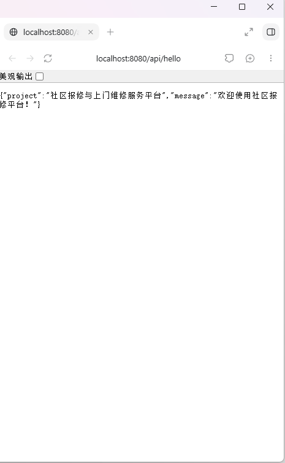
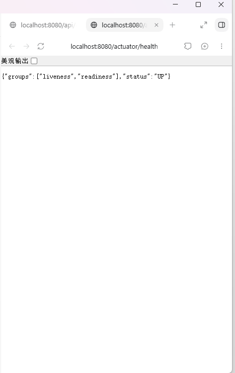

# 第三周：项目规划与 Spring Boot 基础工程

## 项目与本周计划

项目名称：**社区报修与上门维修服务平台**。

目标用户为社区住户、物业管理员、维修人员和平台管理员。准备优先实现“住户提交报修—物业审核派单—维修人员确认接单”的场景，初步规划报修工单（RepairOrder）和维修人员（Technician）两个核心模型。详细规划见 [项目初步规划](../../project-proposal.md)。本周仅记录业务规划，不实现业务模型。

本周计划及完成情况：

- 在仓库根目录的 `monolith/` 创建独立 Maven 工程，`pom.xml` 和 `src/` 位于同一工程内。
- 使用 Java 25、Spring Boot 4.0.8、Maven Wrapper，Group 和源码、测试包名均为 `com.zjgsu.hly`。
- 创建启动类 `CommunityRepairApplication`，统一使用 `application.yml`，默认端口为 8080。
- 引入 Spring Web MVC 和 Actuator，实现简单 GET 问候接口，验证健康检查。
- 完成启动及接口测试，保存运行截图。
- 暂不实现业务 CRUD、Service、Repository、数据库或业务模型代码。

## 启动与测试命令

前提：本机已安装 JDK 25，终端的 `JAVA_HOME` 指向 JDK 25；首次运行需要联网下载 Maven 和依赖。

Linux、macOS 或 Git Bash，在仓库根目录执行：

```bash
cd monolith
./mvnw test
./mvnw spring-boot:run
```

Windows PowerShell，在仓库根目录执行：

```powershell
cd monolith
.\mvnw.cmd test
.\mvnw.cmd spring-boot:run
```

IDEA 打开 `monolith/pom.xml` 作为 Maven 工程，选择 JDK 25，完成依赖同步后运行启动类，或使用 Maven 运行配置执行 `spring-boot:run`；测试使用 Maven 的 `test` 目标。

运行结果：应用成功启动，Tomcat 监听 8080；4 项测试全部通过，0 失败、0 错误。测试使用随机端口，正式运行使用配置中的 8080。停止终端启动的应用可按 `Ctrl+C`。

## 两条接口及实际响应

### 1. 项目问候接口

- 请求方式：`GET`
- 地址：`http://localhost:8080/api/hello`
- HTTP 状态码：`200`
- 实际响应（JSON 字段顺序可能不同）：

```json
{"project":"社区报修与上门维修服务平台","message":"欢迎使用社区报修平台！"}
```



### 2. Actuator 健康检查

- 请求方式：`GET`
- 地址：`http://localhost:8080/actuator/health`
- HTTP 状态码：`200`
- 实际响应：

```json
{"groups":["liveness","readiness"],"status":"UP"}
```

`status` 为 `UP`，表示当前已配置的健康检查通过。`groups` 为健康分组信息，不影响验证结果。本阶段未连接数据库或外部业务服务。



## 作业系统提交材料

公开仓库链接：https://github.com/shigaharuki17/microservices-practice-2412190707

说明文字：本项目为社区报修与上门维修服务平台。本周已在 monolith 目录创建 Java 25、Spring Boot 4.0.8 的 Maven 工程，配置 Spring Web MVC 和 Actuator，实现问候接口。应用在 8080 端口成功启动，健康检查返回 UP，4 项测试全部通过；业务场景与两个核心模型仅做规划，未实现业务 CRUD 和数据库。

上传本目录 `screenshots/` 中的 `api-hello.png` 和 `actuator-health.png` 两张实际运行截图。
